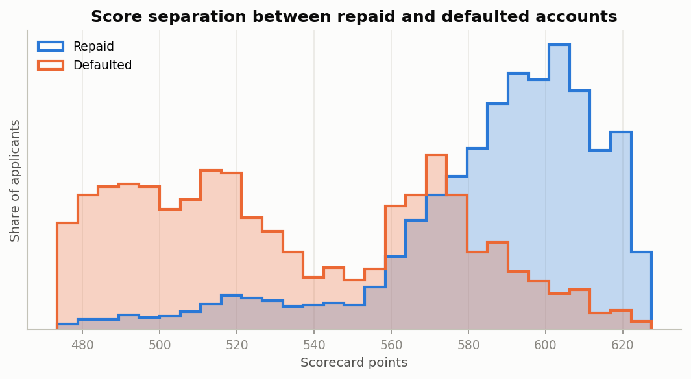
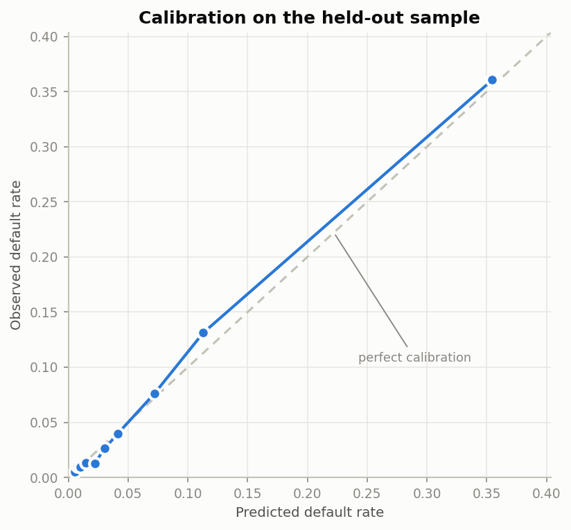
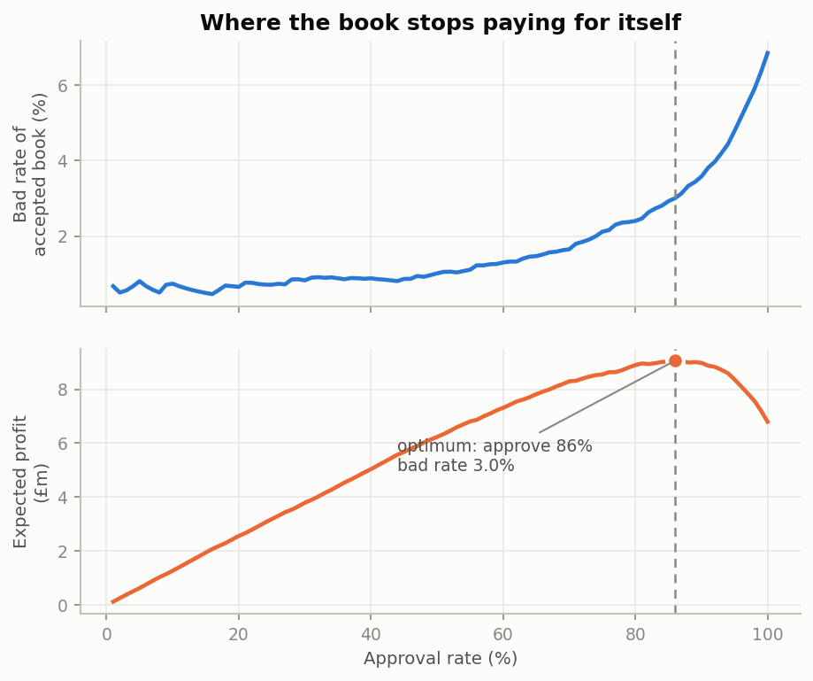

# Credit Risk Scorecard

**An end-to-end probability-of-default model for unsecured consumer lending — built the way a lender would have to build it.**

Not a notebook with an AUC at the bottom. A medallion data pipeline in PySpark, a
Weight-of-Evidence scorecard with a published points table, calibrated
probabilities, adverse-action reason codes, a cut-off chosen on book economics,
and a drift monitor — plus a live app you can score an applicant in.

[](https://github.com/Jimit27/credit-risk-scorecard/actions/workflows/ci.yml)


<!-- DEPLOY ME: push this repo, then go to share.streamlit.io, connect the repo, and set the
     main file to app/streamlit_app.py. Name the app "credit-risk-scorecard" and the URL below
     resolves. Until then, delete this line so the README has no dead link. -->
**[Live demo →](https://credit-risk-scorecard.streamlit.app)** · [Modelling decisions](docs/modelling_decisions.md) · [Data quality](docs/data_quality.md) · [Open Banking track](docs/open_banking.md)

---

## The problem

A lender approving unsecured personal loans has to answer three questions about
every applicant, and a single accuracy score answers none of them:

1. **How likely is this person to default?** — and the answer has to be a *true*
   probability, not just a well-ordered one, because the whole book is priced off it.
2. **Where do we draw the line?** — approving a bad loan and declining a good one
   do not cost the same, so the cut-off is an economic decision, not an F1 score.
3. **Why was this person declined?** — a lender generally has to be able to say,
   specifically. "The gradient boosting said no" is not an answer.

This project answers all three on 150,000 real consumer credit files.

## Headline results

Held-out sample of 29,892 applicants, scored once, at the end.

| | Champion: WoE scorecard | Challenger: gradient boosting |
|---|---|---|
| **Gini** | **0.712** | 0.734 |
| AUC | 0.856 | 0.867 |
| **KS** | **0.568** | 0.579 |
| Brier score | 0.0516 | 0.0501 |
| Predicted vs observed default rate | 6.72% vs 6.85% | 6.77% vs 6.85% |
| Explainable as a points table | **Yes** | No |

The interpretable model is the **champion**, and the boosted model is the
challenger whose job is to price that choice. Interpretability costs about **two
Gini points** here — cheap enough that the scorecard ships. Had the gap been
fifteen, the honest conclusion would have been different, which is the point of
measuring instead of assuming.

Train / validation / test Gini: 0.707 / 0.698 / 0.712 — no overfitting to correct for.

<p align="center">
  
  
</p>

**The model ranks**: the riskiest 20% of applicants contain **72%** of all defaults.
**And the probabilities are true**: predicted and observed default rates agree to
within **1.9 percentage points** in every decile. The second property is the one
most portfolio projects skip, and the one a lender cannot operate without.

## The decision, not just the score

| Grade | Policy cut-off | Share of book | Observed default rate |
|---|---|---|---|
| **A** Very low risk | 615+ | 11.8% | **0.7%** |
| **B** Low risk | 600–614 | 24.2% | **1.0%** |
| **C** Moderate risk | 575–599 | 34.9% | **2.7%** |
| **D** Elevated risk | 545–574 | 15.6% | **9.2%** |
| **E** High risk | below 545 | 13.5% | **30.9%** |

A 47× spread in realised default rate from top grade to bottom, monotonic all the
way down. The cut-offs are the policy boundaries in `conf/config.yaml`; the grade
table is regenerated and checked for monotonicity on every run, and CI fails if it
stops being monotonic.

<p align="center">
  
</p>

Sweeping the cut-off against stated economics (£450 revenue per performing loan,
£2,800 loss given default — declared in `conf/config.yaml`, not buried in code)
puts the optimum at **87% approval and a 3.2% bad rate**, worth **£2.2m more** than
approving everyone on a book this size.

The threshold is chosen on the **validation** split and then applied unchanged to
test, where it approves 87.1%. Picking it by maximising profit on the test set
would be tuning a parameter on the holdout and then quoting that holdout as
unbiased. The economics are illustrative; the method is the transferable part.

## Why this applicant was declined

The champion is a scorecard, so it collapses into a printable points table. Every
decision is the sum of one row per factor — exact, not an approximation, and
reconstructed from the table in the test suite to prove it.

Adverse-action reasons are ranked by distance-to-maximum: the points the applicant
gave up on each factor against the best-scoring band for that factor. This is the
method behind a real decline notice, not a post-hoc SHAP plot relabelled as one.

```
Applicant: 27, £1,850/month, 97% revolving utilisation, 2× 90-day arrears
Score 463  ·  PD 66.0%  ·  Grade E

  1. Revolving credit usage, weighted by past missed payments   −49.5 pts
  2. Times 90+ days late in the last two years                  −27.7 pts
  3. Severity of the worst missed payment on record             −25.0 pts
  4. Age of the applicant                                       −23.7 pts
```

The score is derived from the model's own log-odds, **not** from the calibrated
probability — which is what makes the sum exact. The isotonic calibrator is a
monotone step function, not an affine one, so routing the score through it would
preserve the ranking and destroy the additivity. The two roles stay separate: the
points are the model, the calibrated PD is the price. `test_points_table_reconstructs_the_shipped_score`
checks the rows sum to the shipped score across 300 held-out applicants.

SHAP is wired up for the gradient-boosted challenger, where no closed-form points
table exists.

## Architecture

```
data/raw/cs-training.csv
        │
   ┌────▼──────────────────────────────────────────── PySpark ─────────┐
   │  BRONZE   land as text, nothing corrected, provenance attached    │
   │  SILVER   documented data-quality rules, every one counted        │
   │  GOLD     24 features, hash-based split, partitioned by split     │
   └────┬──────────────────────────────────────────────────────────────┘
        │  Parquet locally · Delta + Unity Catalog on Databricks
        │  (one codebase — creditrisk.spark_utils picks the format)
   ┌────▼──────────────────────────────────────────── pandas ──────────┐
   │  WoE binning → IV selection → prune → 12 features                 │
   │  Logistic scorecard  +  XGBoost challenger                        │
   │  Isotonic calibration on validation · PDO score scaling           │
   └────┬──────────────────────────────────────────────────────────────┘
        │
   ┌────▼──────────────────────────────────────────────────────────────┐
   │  Reason codes · gains & calibration tables · profit curve         │
   │  PSI drift monitor · Streamlit app · MLflow registry (Databricks) │
   └───────────────────────────────────────────────────────────────────┘
```

Spark builds the lake; it is not needed to read it. Training, the app and CI run
on a plain Python install with no JVM — which is what makes the demo deployable on
free hosting.

## What makes this different from the usual credit-risk project

**The data is genuinely messy, and the cleaning is auditable.** Nine documented
defects, each counted into `reports/data_quality.json`: 29,731 incomes written as
the literal text `NA`, 609 byte-identical duplicate applications, utilisation
values up to 50,708, and a `DebtRatio` column that switches from a ratio to an
absolute amount for 22,691 applicants whose income is missing. [Full write-up →](docs/data_quality.md)

**Missingness is treated as information.** The 225 records where the bureau
delinquency counter is *coded* (96/98) rather than counted default at **60%**
against a book average of 6.7%. Dropping those rows — the obvious move — throws
away one of the strongest signals in the dataset.

**Features are pruned, and the cost is measured.** Of the eighteen features that
clear the IV floor, five drop out for pairwise correlation above 0.85 on the WoE
scale and one more — `times_60_89_dpd` — is cut as *degenerate*: 95% of applicants
sit at zero, so after minimum-bin merging it has a single populated bin and
separates nobody. It cleared the IV floor purely on 149 sentinel-coded records,
and would otherwise have sat near the top of the points table looking like a major
driver. Twelve features survive, at a cost of roughly 0.4 Gini points; the
exclusion reason for every dropped feature is written to
`reports/information_values.csv`.

**Training/serving skew is tested, not hoped for.** The gold layer is built in
Spark; the scoring app derives the same features in pandas. Two implementations of
one transformation is exactly how a model quietly starts scoring different features
from the ones it was trained on — so `tests/test_serving_parity.py` re-derives a
3,000-row sample through the serving path and asserts it matches the Spark output.
Edit one and forget the other, and CI fails.

**Two real bugs the tests caught.** The KS statistic was taking the running maximum
*within* tie groups — a WoE scorecard emits a finite set of scores, so ties are the
norm, and the metric was reading an ordering out of applicants the model had scored
identically. And PSI returned a hard `0.0` whenever quantile edges collapsed, which
is exactly what happens to an arrears counter that is 95% zeros: the drift monitor
reported "stable" on the features whose drift matters most. Both now have named
regression tests (`test_ks_is_zero_for_a_constant_score`,
`test_psi_detects_drift_in_a_zero_inflated_counter`); the second case now scores
PSI 3.48 and returns "revalidate".

**Monotonicity is enforced and then verified.** WoE bins are merged until the bad
rate moves in one direction; a scorecard where more arrears can *lower* your risk
is one no credit committee will sign off. Separate tests then confirm the shipped
model never rewards more arrears or higher utilisation.

**The drift monitor is shown firing, not just existing.** Against the holdout it
reports PSI 0.0004 (stable). Against a population bent the way a real book bends —
a new acquisition channel bringing younger applicants on thinner incomes — it
reports **0.189, "investigate"**, and correctly names income, debt ratio and
disposable income as the three features that moved.

**The limits are stated.** No reject inference, no out-of-time validation, no
fairness audit against protected characteristics — and [why, in each
case](docs/modelling_decisions.md#what-this-model-does-not-do). Including the
awkward one: age is in the feature set, it is a protected characteristic in several
jurisdictions, and that would need a policy decision before production.

## The Open Banking track

A second, clearly-separated module covering what an affordability-first lender does
with transaction data: merchant categorisation and cashflow feature engineering.

**The ledger is simulated, contributes nothing to the headline metrics, and no
predictive claim is made from it.** No public dataset links real current-account
transactions to real default outcomes — so a project claiming a "cashflow uplift"
on public data is measuring an artefact of its own generator.

What it does report is a real result about the hard part. Categorising merchants
the model has never seen, evaluated by holding out **whole merchants** rather than
random transactions:

| Model | Accuracy on unseen merchants |
|---|---|
| Always guess the most common category | 21.3% |
| Character n-grams on the description | **13.2%** |
| Description **plus transaction behaviour** | **36.7%** |

Text alone lands below even a majority-class guess: nothing in `OCTOPUS ENERGY`
resembles `EDF ENERGY`, and the n-gram model confidently maps unfamiliar strings
onto whichever category shares incidental characters. Adding *how the transaction
behaves* — amount, sign, recurrence, amount stability — takes it to 1.7× the
majority-class baseline, because an unseen merchant is still recognisable as
"monthly, fixed, large". 37% is still hard, which is exactly why commercial
providers maintain curated merchant dictionaries and use a model only for the tail.
(The baseline quoted is majority-class, not a uniform 1-in-12 guess — the held-out
transactions are heavily skewed toward groceries and shopping, and quoting 8.3%
would flatter every model measured against it.)
[Full write-up →](docs/open_banking.md)

## Run it

```bash
git clone https://github.com/Jimit27/credit-risk-scorecard
cd credit-risk-scorecard
make install          # no JVM needed
make app              # the model bundle ships in the repo, so this works immediately
```

To rebuild everything from the raw extract:

```bash
make install-spark    # adds PySpark (needs Java 17 or 21)
make data             # downloads cs-training.csv
make pipeline         # bronze → silver → gold → train → monitor → openbanking → figures
make test
```

Individual stages: `python -m creditrisk.pipeline train figures`.

## Repository layout

```
src/creditrisk/
  ingest.py       bronze  · land the extract as text, nothing corrected
  clean.py        silver  · 9 data-quality rules, each one counted
  features.py     gold    · feature engineering + deterministic hash split
  woe.py                  · monotonic WoE binning, Information Value
  train.py                · champion/challenger, selection, calibration
  metrics.py              · Gini, KS, PSI, calibration, gains, profit curve
  scorecard.py            · PD → points, policy grades
  explain.py              · points table, reason codes, SHAP
  monitoring.py           · PSI drift on score and features
  serving.py              · pandas mirror of the gold derivations + imputation
  model.py                · the picklable bundle the app and tests load
  openbanking.py          · simulated ledger, categorisation, cashflow features
  plots.py, pipeline.py, spark_utils.py, config.py
app/streamlit_app.py      · scoring UI, reason codes, performance, points table
notebooks/databricks/     · Delta + Unity Catalog, MLflow registry, scheduled jobs
tests/                    · 71 tests
docs/                     · data quality, modelling decisions, Open Banking
reports/                  · metrics, bin tables, figures — all regenerated by the pipeline
```

## Databricks

`notebooks/databricks/` runs the same package against Delta tables in Unity
Catalog: the medallion build with `OPTIMIZE`/`ZORDER` and job-failing expectations,
MLflow experiment tracking with an automated promotion gate on Gini, KS, Brier,
grade monotonicity and population stability, and a scheduled scoring + drift job
that appends to a monitoring table and stops the line on a material shift.

The transformation code is not duplicated — `creditrisk.spark_utils.table_format()`
returns `delta` inside a Databricks runtime and `parquet` locally, and nothing in
`clean.py` or `features.py` knows the difference. These notebooks are written for a
workspace and are not exercised by CI; the local Parquet path is.

## Data

[Give Me Some Credit](https://www.kaggle.com/c/GiveMeSomeCredit) (Kaggle, 2011):
150,000 real consumer credit files, target is 90+ days past due within two years,
6.7% base default rate. Not committed — `make data` fetches it.

## Licence

MIT — see [LICENSE](LICENSE).
